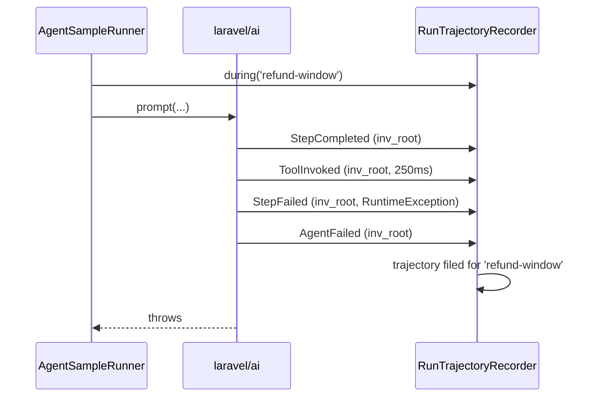

# Failed Runs & Timing

[Trajectories](/guides/trajectories) are built from the response the agent
returned. That is the right source for a run that returned one. Two things are
structurally missing from it, and both are where the interesting evals live.

::: callout info
Needs `laravel/ai` **^0.11**, where the run events were added. On an older SDK
nothing registers and the response mapper behaves exactly as before.
:::

## A run that failed has no response

The agent that threw on its third step is the one you most want in your dataset.
It is also the one `AgentResponseTrajectory` never sees: the call raised, there is
no response object, and the mapper is never reached.

`RunTrajectoryRecorder` listens instead. By the time the exception propagates, the
steps and tool calls have already been recorded, so the trajectory survives the
throw:

```php
$trajectory = app(RunTrajectoryRecorder::class)->trajectoryFor('refund-window');

$trajectory->finishReason;                  // 'error'
$trajectory->steps;                         // 2 — it got that far
$trajectory->toolCalls;                     // what it managed to call
$trajectory->metadata['error_class'];       // RuntimeException
$trajectory->metadata['error_message'];     // 'upstream exploded'
```

`finishReason` is `'error'` rather than left null on purpose: a `finish-reason`
assertion should read as **failed**, not as *absent*.

## Timing is not on the response

`Laravel\Ai\Responses\Data\Step` carries text, tool calls, tool results, finish
reason, usage and meta. No duration. So `ToolCall::$durationMs` — a field the
eval-harness DTO has always had — could never be populated from a response, and a
tool that threw looked exactly like a tool that returned nothing.

```php
$call = $trajectory->toolCalls[0];

$call->name;        // 'refund_order'
$call->failed();    // true
$call->error;       // 'timed out'
$call->durationMs;  // 9000
```

Nine seconds before a throw is a **timeout**. Zero is a **rejection**. They are
different bugs with different fixes, and only the duration tells them apart.

## How a run is tied to a sample

By scope, not by id. `AgentSampleRunner` wraps its call:

```php
$runs->during($sample->id, fn () => ($this->agent)($sample->input, $sample));
```

The **first** invocation whose events arrive inside that scope is the run under
test. An agent used as a tool starts its own invocation, which is counted in
`metadata.delegated_runs` rather than mistaken for the run being scored.



One run at a time per process — which is what an eval pass does: repetitions are
sequential, and the batch modes fan out to separate queue workers.

## Precedence when a run succeeds

Both sources are used, each for what it knows:

| Field | Winner | Why |
|---|---|---|
| `toolCalls` | events | Only they carry a duration, and only they record a tool that threw |
| `steps` | events, response as fallback | |
| `finishReason` | response | It knows `pending_approval`, which no step reports |
| `pendingApprovals`, `approvals` | response | Approval state is response state |
| `metadata` | merged | Response usage plus `invocation_id` and `delegated_runs` |

## Wiring

None. The service provider is auto-discovered, binds the recorder as a singleton
(it holds the in-flight buffer and the scope), and registers the six listeners
behind a `class_exists` guard.

Passing your own recorder to `AgentSampleRunner` still works, and so does using
the package with no container at all — the runner falls back to the response
mapper, which is what it did before.
